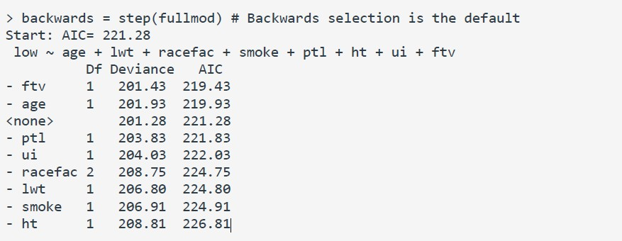

```{r setup, include=FALSE}
knitr::opts_chunk$set(echo = TRUE)
```

# Problem 1

(1) Variable selection is a simple and solved statistical problem since we can implement it using the R statistical software.

- False

(2) It is good practice to perform variable selection based on the statistical significance of the regression coefficients. 

- False

(3) Akaike Information Criterion (AIC) is an estimate for the prediction risk. 

- True 

(4) Bayesian information criterion (BIC) penalizes for complexity of the model more than both leave-one-out CV and Mallow's Cp statistic.  

- False

(5) When the number of predicting variables is large, both backward and forward stepwise regressions will always select the same set of variables. 

- False

(6) Complex models with many predictors are often extremely biased but have low variance. 

- False

(7) Backward stepwise regression is preferable over forward stepwise regression because it starts with larger models. 

- True

(8) Stepwise regression is a greedy algorithm searching through all possible combinations of the predicting variables to find the model with the best score. 

- True

(9) The L2 penalty measures the sparsity of a vector and forces regression coefficients to be zero. 

- False

(10) Elastic net regression uses both penalties of ridge and lasso regression and hence combines the benefits of both. 

- True 

(11) It is not required to standardize or rescale the predicting variables when performing regularized regression. 

- True

(12) Ridge regression is a regularized regression approach that can be used for variable selection. 

- False

(13) The lasso regression requires a numerical algorithm to minimize the penalized sum of least squares. 

- True

(14) In regularized regression, the penalization is generally applied to all regression coefficients, where p = number of predictors. 

- True

(15) The penalty constant lambda in penalized regression controls the trade-off between lack of fit and model complexity 

- False

(16) In ridge regression, when the penalty constant lambda equals one, the corresponding ridge coefficient estimates are the same as the ordinary least square estimates. 

- False

(17) Ridge regression cannot be used to deal with problems caused by high correlation among the predictors. 

- False

(18) When using the same variable selection criterion (e.g. BIC), forward stepwise regression and backward stepwise regression always select the same set of predictors. 

- False

(19) Forward stepwise selection is more computationally expensive than backward stepwise selection because it takes more iterations to converge. 

- False

(20) Generally, a model with too many predictors has low bias, and low variance. 

- False

(21) In Ridge regression, as the penalty term increases, the shrinkage of the ridge coefficient estimates leads to a reduction in the variance of the predictions, but an increase in the bias. 

- True 

(22) Mary has a dataset with height (in inches), weight (in lbs), and math_score (final exam score out of 100) of 300 students in an undergraduate math course. She creates another field called BMI (Body Mass Index) calculated as ($BMI = 703 * weight/height^2$). She wants to examine if math_score is related to height, weight and BMI. She plans to use a linear regression model ($mathscore = height + weight + BMI$) to study this relationship. Leonard hears about Mary's plan and tells Mary that BMI should not be used in her experiment because it is created from the height and weight variables which are already included in the model. He says this leads to an issue called multicollinearity in linear regression. Which of the below options is TRUE? 

B. Leonard is wrong; it is impossible to say whether multicollinearity could be a problem in a proposed model without first fitting the model. 

(23) Which of the following is correct? 

B. Lasso regression uses the L1 norm. 

(24) Which of the following problems can be addressed by Ridge Regression? Select ALL correct answers. 

B. Multicollinearity 
C. Overfitting (Low bias and high variance) 

(25) Which of the following problems can be addressed by Elastic Net Regression? Select ALL correct answers. 

B. Multicollinearity 
C. Overfitting (Low bias and high variance) 

(26) When the number of predictors, is greater than the number of data points, which of the following options cannot be applied? 

A. Lasso regression 

(27) Backward stepwise regression was carried on a model and the result is shown in the table below.



Which predictor(s) would be removed in the first step?

C. Ftv

# Problem 2

In this problem, we will return to the study of the relationship between geographic access to healthcare services and severe health outcomes for pediatric asthma. Particularly, we will perform variable selection to identify which predicting variables are selected for explaining the variations in the proportion of the emergency department (ED) visits encountered by children in the state of Georgia.

Reference: Garcia, E., Serban, N., Swann, J., Fitzpatrick, A. (2015) “A study of the Impact of Geographic Access on Severe Health Outcomes for Pediatric Asthma”, Journal of Allergy and Clinical Immunology, 136(3):610-8.

The response data and the predicting variables are observed for all counties in Georgia. Counties form a contiguous geographic division of a state in the United States, for example, Georgia has 159 different counties. The first column in the data file (County) specifies the names of the counties.

```{r Library Import, include=FALSE}
library(tidyverse)
library(tidymodels)
library(poissonreg)
library(glmnet)
library(vip)
library(doParallel)

all_cores <- parallel::detectCores(logical = FALSE)

cl <- makePSOCKcluster(all_cores)
registerDoParallel(cl)
```

```{r Model Specification}
pois_spec <-
  poisson_reg() |>
  set_mode("regression") |>
  set_engine("glm")

lasso_pois_spec <-
  poisson_reg(penalty = tune(), mixture = 1) |>
  set_mode("regression") |>
  set_engine("glmnet")

elastic_pois_spec <-
  poisson_reg(penalty = tune(), mixture = tune()) |>
  set_mode("regression") |>
  set_engine("glmnet")
```

```{r Data Import}
data <- read_csv("data/GA_EDVisits.csv", show_col_types = FALSE)

data <-
  data |>
  na.omit()

data <-
  data |>
  rename(ED_visits = `ED visits`) |>
  select(-County, -Asthma_children, -A15.17)

set.seed(100)
# 10-fold CV
data_folds <- vfold_cv(data, v = 10)
```


```{r Model 1 Recipe}
# Recipe Creation for Tidy Models
model1_rec <-
  recipe(ED_visits ~ ., data = data) |>
  step_dummy(all_nominal_predictors()) |>
  step_log(SpecDist, PedDist) |>
  step_zv(all_numeric_predictors()) |>
  step_normalize(SpecDist, PedDist, MedianIncome, No.Hospitals, PercentLessHS, PercentHS)

# Recipe Creation for Model 2
model2_rec <-
  recipe(ED_visits ~ ., data = data) |>
  step_dummy(all_nominal_predictors()) |>
  step_log(SpecDist, PedDist) |>
  step_zv(all_numeric_predictors()) |>
  step_normalize(SpecDist, PedDist, MedianIncome, No.Hospitals, PercentLessHS, PercentHS) |>
  step_interact(~ SpecDist:A5.9 + SpecDist:A10.14 + SpecDist:MedianIncome + SpecDist:PercentLessHS + SpecDist:PercentHS +
                  PedDist:A5.9 + PedDist:A10.14 + PedDist:MedianIncome + PedDist:PercentLessHS + PedDist:PercentHS)

# Creating Preprocessed Dataset
prepped2 <-
  model2_rec |>
  prep() |>
  juice()
```

```{r Model 1 & 2 Workflows}
# Creating Workflow for Model 1
lm_wflow_m1 <-
  workflow() |>
  add_recipe(model1_rec) |>
  add_model(pois_spec)

# Creating Workflow for Model 2
lm_wflow_m2 <-
  workflow() |>
  add_recipe(model2_rec) |>
  add_model(pois_spec)
```

```{r Model Fitting}
# Model 1 Fit
model1 <- lm_wflow_m1 |> fit(data)

model1_tidy <- model1 |>
  extract_fit_parsnip() |>
  tidy()

model1_eng <- 
  model1 |>
  extract_fit_engine()

# Model 2 Fit
model2 <- lm_wflow_m2 |> fit(data)

model2_tidy <-
  model2 |>
  extract_fit_parsnip() |>
  tidy()

model2_eng <- 
  model2 |>
  extract_fit_engine()
```


```{r Evaluation of Model 1 & 2}
# Summary of Model 1
summary(model1_eng)

# Summary of Model 2
summary(model2_eng)
```

(1) Fit model1 and model2. Which of the following is true? Show your code and appropriate output to support your choice. [10 pts]

- The AIC of model2 is less than the AIC of model1

<https://advstats.psychstat.org/book/mregression/selection.php>
for the simple code for forward stepwise regression

```{r Forward Stepwise Model using MASS}
null = glm(ED_visits ~ A5.9 + A10.14 + No.Hospitals + PercentLessHS + PercentHS + MedianIncome + SpecDist + PedDist, family = "poisson", data = prepped2)
full = glm(ED_visits ~ ., family = "poisson", data = prepped2)

MASS::stepAIC(null, scope = list(lower=null, upper=full), data=prepped2, direction='both')
```

(2) Next you will perform a forward-backward stepwise regression using AIC. Let the minimum and starting model be the model with no interactions (model1) and the full model be the one with interactions (model2). Based on this stepwise regression procedure, which of the following are true? Select all that are true. Show your code and appropriate output to support your choice. [10 pts]

- The first two interaction terms entering the model were DistPHS and DistHS
- Once each interaction term entered the model, it was never discarded from the model
- There are regression coefficients for the interactions terms in the final selected model that are not statistically significant at the alpha level of 0.01

(3) Which of the following is true regarding the final selected model from the previous question? [4 pts]

- All but one of the interaction terms are included in the final model

```{r LASSO Poisson Regression in Tidymodels}
registerDoParallel(cl)
# Setting up the Basic Workflow for Lasso based on Silge
lasso_param <-
  workflow() |>
  add_recipe(model2_rec) |>
  add_model(lasso_pois_spec) |>
  extract_parameter_set_dials()

# LASSO Workflow
lasso_wkflw <-
  workflow() |>
  add_recipe(model2_rec) |>
  add_model(lasso_pois_spec)

# Setting up a Grid for Tuning the LASSO Regression
lambda_grid <- lasso_param |>
  grid_regular(levels = 50)

# Finding Lambda based on 10 Fold CV
set.seed(100)
lasso_initial <-
  lasso_wkflw |>
  tune_grid(resamples = data_folds, grid = lambda_grid)

# Selecting Lambda based on the best RMSE value from the Tuned Grid
lowest_lasso_rmse <- lasso_initial |>
  select_best("rmse")

# Final Lasso Regression Workflow
final_lasso <- finalize_workflow(
  lasso_wkflw,
  lowest_lasso_rmse
)

# Tidying the LASSO Fit
lasso_tidy <-
  final_lasso |>
  fit(data = data) |>
  extract_fit_parsnip() |>
  tidy() |>
  rename(name = term)

stopImplicitCluster()
```

<https://www.jihongzhang.org/post/2019-02-19-lasso-regression-with-glmnet/> 
for the function to get the coefficients out of the glmnet model into a tibble and the graph

```{r CV Calculations from GLMnet outside Tidymodels}
# Getting Preprocessed Data into a form the GLMnet can use
prepped2_x <-
  prepped2 |>
  select(-ED_visits)
prepped2_x <- as.matrix(prepped2_x)

prepped2_y <-
  prepped2 |>
  select(ED_visits)

prepped2_y <- prepped2_y$ED_visits

# Generating cv Glmnet (non-tidymodels)
cv_model <- cv.glmnet(x = prepped2_x, y = prepped2_y, family = "poisson" , alpha = 1, type.measure = "deviance", nfolds = 10)

coef(cv_model, s = cv_model$lambda.min)

# create a function to transform coefficient of glmnet and cvglmnet to data.frame
coeff2dt <- function(fitobject, s) {
  coeffs <- coef(fitobject, s) 
  coeffs.dt <- data.frame(name = coeffs@Dimnames[[1]][coeffs@i + 1], coefficient = coeffs@x) 

  # reorder the variables in term of coefficients
  return(coeffs.dt[order(coeffs.dt$coefficient, decreasing = T),])
}

cv_table <- coeff2dt(fitobject = cv_model, s = "lambda.min") |>
  as_tibble() |>
  bind_cols(lambda = cv_model$lambda.min)

# Getting a slight different but similar Coefficient Graph to LASSO
ggplot(data = cv_table) +
  geom_col(aes(x = name, y = coefficient, fill = {coefficient > 0})) +
  xlab(label = "") +
  theme(axis.text.x = element_text(angle = 45, hjust = 1),
        legend.position = "none") 

# Comparing the Results from Tidymodels to cv.glmnet to check and compare
cv_table |> left_join(lasso_tidy)
```

```{r LASSO Graphs}
# Regression Coefficient Path
final_lasso |>
  fit(data = data) |>
  extract_fit_engine() |>
  autoplot()

# A very nice graph that shows the predictors in Columns
final_lasso |>
  fit(data) |>
  extract_fit_parsnip() |>
  vi(lambda = lowest_lasso_rmse$penalty) |>
  mutate(
    Importance = abs(Importance),
    Variable = fct_reorder(Variable, Importance)
  ) |>
  ggplot(aes(x = Importance, y = Variable, fill = Sign)) +
  geom_col() +
  scale_x_continuous(expand = c(0,0)) +
  labs(y = NULL)
```
(4) Perform Lasso regression with ED.visits as the Poisson response variable and all variables in X as the predicting variables. Use the glmnet() R commands and set the type of measure to be the deviance and the number of folds to be 10 for obtaining the penalty constant lambda using cross-validation.
Which or the following are true? Select all that are true. Show your code and appropriate output to support your choice. [10 pts]
Note: Please run set.seed(100) before your code for this question.

- The penalty lambda value resulting in the lowest cross-validation error is between 0 and 2

(5) Which of the following is true regarding the optimal model selected in the previous question? [2 Pts]

- All main effects are selected

```{r Elastic Poisson Regression in Tidymodels}
registerDoParallel(cl)
# Setting up the Basic Workflow for Lasso based on Silge
elastic_param <-
  workflow() |>
  add_recipe(model2_rec) |>
  add_model(elastic_pois_spec) |>
  extract_parameter_set_dials()

# Elastic Workflow
elastic_wkflw <-
  workflow() |>
  add_recipe(model2_rec) |>
  add_model(elastic_pois_spec)

# Setting up a Grid for Tuning the LASSO Regression
elastic_grid <- elastic_param |>
  grid_regular(levels = 50)

# Finding Lambda based on 10 Fold CV
set.seed(100)
elastic_initial <-
  elastic_wkflw |>
  tune_grid(resamples = data_folds, grid = elastic_grid)

# Selecting Lambda based on the best RMSE value from the Tuned Grid
lowest_elastic_rmse <- elastic_initial |>
  select_best("rmse")

# Final Lasso Regression Workflow
final_elastic <- finalize_workflow(
  elastic_wkflw,
  lowest_elastic_rmse
)
elastic_tidy <-
  final_elastic |>
  fit(data = data) |>
  extract_fit_parsnip() |>
  tidy() |>
  rename(name = term)

stopImplicitCluster()
```


```{r Elastic }
# Elastic Coefficients
elastic_tidy

# Regression Coefficient Path
final_elastic |>
  fit(data = data) |>
  extract_fit_engine() |>
  autoplot()

# A very nice graph that shows the predictors in Columns
final_elastic |>
  fit(data) |>
  extract_fit_parsnip() |>
  vi(lambda = lowest_elastic_rmse$penalty) |>
  mutate(
    Importance = abs(Importance),
    Variable = fct_reorder(Variable, Importance)
  ) |>
  ggplot(aes(x = Importance, y = Variable, fill = Sign)) +
  geom_col() +
  scale_x_continuous(expand = c(0,0)) +
  labs(y = NULL)
```

(6) Like Question 4, perform elastic net regression. Use alpha = 0.5. Show your code and appropriate output to support your choice. [10 pts]
Note: Please run set.seed(100) before your code for this question.
Which of the following is true regarding the optimal model?

- All main effects are selected
