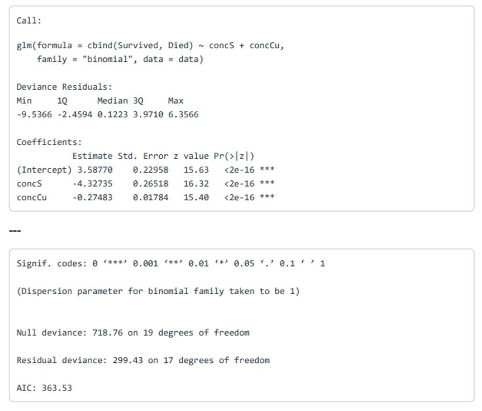

```{r setup, include=FALSE}
knitr::opts_chunk$set(echo = TRUE)
```

# Problem 1
### True/False Portion

1) In logistic regression, the relationship between the probability of success and the predicting variables is nonlinear. 
- True

2) In logistic regression, the error terms are assumed to follow a normal distribution. 
- True

3) The logit function is the log of the ratio of the probability of success to the probability of failure. It is also known as the log odds function.
- True

4) The number of parameters that need to be estimated in a logistic regression model with 6 predicting variables and an intercept is the same as the number of parameters that need to be estimated in a standard linear regression model with an intercept and same predicting variables. 
- True

5) The log-likelihood function is a linear function with a closed-form solution. 
- False

6) In logistic regression, the estimated value for a regression coefficient bi represents the estimated expected change in the response variable associated with one unit increase in the corresponding predicting variable, xi, holding all else in the model fixed. 
- False

7) Under logistic regression, the sampling distribution used for a coefficient estimator is a Chi-squared distribution when the sample size is large.
- False

8) When testing a subset of coefficients, deviance follows a chi-square distribution with q degrees of freedom, where q is the number of regression coefficients in the reduced model. 
- True

9) It is a good practice to perform a goodness-of-fit test on logistic regression models without replications. 
- True

10) In logistic regression, if the p-value of the deviance test for goodness-of-fit is smaller than the significance level a, then it is plausible that the model is a good fit. 
- False

11) If a logistic regression model provides accurate classification, then we can conclude that it is a good fit for the data. 
- True

12) For both logistic and Poisson regression, the deviance residuals should approximately follow the standard normal distribution if the model is a good fit for the data. 
- True

13) Although there are no error terms in a logistic regression model using binary data with replications, we can still perform residual analysis. 
- True

14) The estimated regression coefficients in Poisson regression are approximate. 
- True

15) A t-test is used for testing the statistical significance of a coefficient given all predicting variables in a Poisson regression model. 
- False

16) An overdispersion parameter close to 1 indicates that the variability of the response is close to the variability estimated by the model. 
- True

17) In Poisson regression, we assume a nonlinear relationship between the log rate and the predicting
variables. 
- False

### Interpretation Portion


18) Interpret the coefficient for concCu.
- A 1-unit increase in the concentration of copper decreases the log odds of botrytis blight surviving by 0.27483 when sulfur stays fixed.

19) Suppose you wanted to test if the coefficient for concCu is equal to -0.3. What z-value would you use for this test? 
- 1.411

20) Construct an approximate 95% confidence interval for the coefficient of concS.
- (-4.847, -3.808) 

21) What is the probability of survival for a botrytis blight sample exposed to a copper concentration of 0.6 and a sulfur concentration of 0.6?
- 0.696 

22) The p-value for testing the overall regression can be obtained from which of the following?
- 1-pchisq(419.33, 2)

23) The p-value for a goodness-of-fit test using the deviance residuals for the regression can be obtained from which of the following?
- 1-pchisq(299.43, 17)


```{r Library Load, include=FALSE}
library(tidyverse)
library(tidymodels)
# library(ggplot2)
```

# Problem 2

```{r Data Import}
company <- read_csv("data/hw4_data.csv", show_col_types = FALSE)

company <-
  company %>%
  rename(
    age_group = `Age Group`,
    gender = Gender,
    tenure = Tenure,
    num_of_products = `Num Of Products`,
    is_active_member = `Is Active Member`,
    stay = Stay,
    employees = Employees
  ) %>%
  mutate(
    staying = stay / employees,
    prob_staying = ifelse(staying > 0.5, "Yes", "No"),
    prob_staying = as.factor(prob_staying)
  )
```

```{r Model 1}
# Spending Data Allocation for Modelling
set.seed(123)
company_split <- initial_split(company, prop = 0.80, strata = staying)
company_train <- training(company_split)
company_test <- testing(company_split)

# Model 1 Logistic Regression
model1 <- glm(staying ~ num_of_products, data = company_train, family = binomial)
model1_tidy <- tidy(model1)

m1_coefficients <- model1_tidy$estimate
m1_beta1 <- m1_coefficients[2]
odds <- (1 - exp(m1_beta1)) * 100

# Determining Degrees of Freedom
m1_n <- nrow(company_train) - 1
m1_k <- length(m1_coefficients) - 1
m1_df <- m1_n - m1_k - 1
```

### Fitting a Model
a. Display the summary of model1. What are the model parameters and estimates? (2 pts)
``` {r Summary of Model 1}
summary(model1)
```
b. Write down the equation for the odds of staying. (2 pts)
$$ln(p/1-p) = 2.1337 - 1.7068 * numproducts$$
$$p = e^{2.1337 - 1.7068 * numproducts} / (1 + e^{2.1337 - 1.7068 * numproducts})$$

c. Provide a meaningful interpretation for the coefficient for Num.Of.Products with respect to the log-odds of staying and the odds of staying. (2 pts)
- For each increase of num_of_products owned, the log odds of an employee staying is decreased by 1.7068. The odds of an employee staying as the num of products owned is increased is decreased by 81.9%

### Inference
a. Using model1, find a 90% confidence interval for the coefficient for Num.Of.Products. (3 pts)
```{r Confidence Interval}
suppressWarnings(confint(model1, "num_of_products", level = .90))
suppressWarnings(exp(confint(model1, "num_of_products", level = .90)))
```

b. Is model1 significant overall? How do you come to your conclusion? (3 pts)
```{r Model 1 Significance}
# Test for Overall Regression
gstat <- model1$null.deviance - deviance(model1)
model1_pval <- 1 - pchisq(gstat, length(coef(model1)) - 1)
tibble(gstat, model1_pval)
```
- The model is significant through the Chi-Squared Overall Regression test. This is different from the Goodness of Fit testing where the P-value should be large. The model however is significant with significant coefficients and a significant model.

c. Provide a meaningful interpretation for the coefficient for Num.Of.Products with respect to the log-odds of staying and the odds of staying. (3 pts)
- For each increase of num_of_products owned, the log odds of an employee staying is decreased by 1.7068. The odds of an employee staying as the num of products owned is increased is decreased by 81.9%

### Goodness of fit
a. Perform goodness of fit hypothesis tests using both deviance and Pearson residuals. What do you conclude? Explain the differences, if any, between these findings and what you found in Question 2b. (3.5 pts)
```{r Goodness of Fit for Model 1}
# Test for GOF: Using Deviance Residuals
deviances_1 <- residuals(model1, type = "deviance")
dev_tvalue_1 <- sum(deviances_1^2)
dev_chi_sq <- 1 - pchisq(dev_tvalue_1, m1_df)
tibble(dev_tvalue_1, dev_chi_sq)

# Test for GOF: Using Pearson Residuals
pearson_res_1 <- residuals(model1, type = "pearson")
pearson_tvalue_1 <- sum(pearson_res_1^2)
pear_chi_sq <- 1 - pchisq(pearson_tvalue_1, m1_df)
tibble(pearson_tvalue_1, pear_chi_sq)
```
- The P value in both instances Does not Reject the Null Hypothesis. Therefore the model is significant and a good fit for the data. 

b. Perform visual analytics for checking goodness of fit for this model and write your observations. Be sure to address the model assumptions. Only deviance residuals are required for this question. (3.5 pts)
```{r}
plot(company_train$num_of_products, deviances_1, ylab = "Std Residuals", xlab = "Num of Products")
boxplot(deviances_1 ~ company_train$num_of_products, ylab = "Std Residuals", xlab = "Num of Products")
qqnorm(deviances_1, ylab = "Std Residuals")
qqline(deviances_1, col = "blue", lwd = 2)
hist(deviances_1, 10, xlab = "Std Residuals", main = "")
```

c. Calculate the dispersion parameter for this model. Is this an overdispersed model? (2 pts)
```{r Dispersion Parameter Model 1}
# Dispersion Parameter
dp <- sum(pearson_res_1^2) / model1$df.residual
dp
```
- The dispersion coefficient is over over 3 which is more than 1 and not close to 1, so our model is over dispersed. 

### Fitting the full model
Fit a logistic regression model using Staying as the response variable with Age.Group, Gender, Tenure, Num.Of.Products, and Is.Active.Member as the predictors and logit as the link function. Call it model2.
```{r Model 2}
# Model 2 Logistic Regression
model2 <- glm(staying ~ age_group + gender + tenure + num_of_products + is_active_member, data = company_train, family = binomial)
model2_tidy <- tidy(model2)

m2_coefficients <- model2_tidy$estimate
m2_age_group <- m2_coefficients[2]
m2_isactivemember <- m2_coefficients[6]

m2_age_odds <- exp(m2_age_group)
m2_member_odds <- (1 - exp(m2_isactivemember)) * 100

# Determining Degrees of Freedom
m2_n <- nrow(company_train) - 1
m2_k <- length(m2_coefficients) - 1
m2_df <- m2_n - m2_k - 1

summary(model2)
```


a. Write down the equation for the probability of staying. (2.5 pts)
$$ln(p/1-p) = -2.1377 + 1.242 * agegroup - 0.540 * gender + 0.013 * tenure - 1.326 * numofproducts - 0.911 * isactivemember$$
$$p = e^{-2.1377 + 1.242 * agegroup - 0.540 * gender + 0.013 * tenure - 1.326 * numofproducts - 0.911 * isactivemember} / (1 + e^{-2.1377 + 1.242 * agegroup - 0.540 * gender + 0.013 * tenure - 1.326 * numofproducts - 0.911 * isactivemember})$$

b. Provide a meaningful interpretation for the coefficients of Age.Group and Is.Active.Member with respect to the odds of staying. (2.5 pts)
- The odds of staying increase 246% for each increase in age group and the age group predictor is significant on its own. The odds of staying decrease by 59.8% when is active member increases. 

c. Is Is.Active.Member significant given the other variables in model2? (2.5 pts)
- Yes. It is signficant by being slightly under .05 value.

d. Has your goodness of fit been affected? Repeat the tests, plots, and dispersion parameter calculation you performed in Question 3 with model2. (10 pts)

```{r Model 2 Checking}
# Test for Overall Regression
gstat2 <- model2$null.deviance - deviance(model2)
model2_pval <- 1 - pchisq(gstat2, length(coef(model2)) - 1)
tibble(gstat2, model2_pval)

# Test for GOF: Using Deviance Residuals
deviances_2 <- residuals(model2, type = "deviance")
dev_tvalue_2 <- sum(deviances_2^2)
dev_chi_sq2 <- 1 - pchisq(dev_tvalue_2, m2_df)
tibble(dev_tvalue_2, dev_chi_sq2)

# Test for GOF: Using Pearson Residuals
pearson_res_2 <- residuals(model2, type = "pearson")
pearson_tvalue_2 <- sum(pearson_res_2^2)
pear_chi_sq2 <- 1 - pchisq(pearson_tvalue_2, m2_df)
tibble(pearson_tvalue_2, pear_chi_sq2)

# Dispersion Parameter
dp <- sum(pearson_res_2^2) / model2$df.residual
dp
```
- This model is significant and it does not reject the null hypothesis for both of the goodness of fit tests. The dispersion parameter is also much closer to 1. This would indicate that this is a much better model fit than model 1. The graphs below also support this conclusion. 

```{r Model 2 Plots}
# Age Group Plots
plot(company_train$age_group, deviances_2, ylab = "Std Residuals", xlab = "Age Group")
boxplot(deviances_2 ~ company_train$age_group, ylab = "Std Residuals", xlab = "Age Group")

# Gender Plots
plot(company_train$gender, deviances_2, ylab = "Std Residuals", xlab = "Gender")
boxplot(deviances_2 ~ company_train$gender, ylab = "Std Residuals", xlab = "Gender")

# Tenure Plots
plot(company_train$tenure, deviances_2, ylab = "Std Residuals", xlab = "Tenure")
boxplot(deviances_2 ~ company_train$tenure, ylab = "Std Residuals", xlab = "Tenure")

# Num of Product Plots
plot(company_train$num_of_products, deviances_2, ylab = "Std Residuals", xlab = "Num of Products")
boxplot(deviances_2 ~ company_train$num_of_products, ylab = "Std Residuals", xlab = "Num of Products")

# Active Member Plots
plot(company_train$is_active_member, deviances_2, ylab = "Std Residuals", xlab = "Active Member")
boxplot(deviances_2 ~ company_train$is_active_member, ylab = "Std Residuals", xlab = "Active Member")

qqnorm(deviances_2, ylab = "Std Residuals")
qqline(deviances_2, col = "blue", lwd = 2)
hist(deviances_2, 10, xlab = "Std Residuals", main = "")
```

### Prediction


```{r Prediction}
employee_y <- tibble(age_group = 2, gender = 0, tenure = 2, num_of_products = 2, is_active_member = 1)

prediction_m1 <- tibble(pred1 = predict(model1, newdata = employee_y, type = "response"))
prediction_m2 <- tibble(pred2 = predict(model2, newdata = employee_y, type = "response"))

prediction_combined <- bind_cols(prediction_m1, prediction_m2) %>%
  mutate(staying1 = ifelse(pred1 >= .5, "Yes", "No"),
         staying2 = ifelse(pred2 >= .5, "Yes", "No"))
prediction_combined
```
a. Predict their probability of staying using model1. (2 pts)
- Model 1 predicts that this individual will not be retained. This seems to check out with the model and its predictor.

b. Predict their probability of staying using model2. (2 pts)
- Model 2 predicts that this individual will not be retained and this is also supported by the model and its predictors. 

c. Comment on how your predictions compare. (2 pts)
- Both model's predict the same, however, model 2 predicts with more certainty the fact that the individual will depart the company. This also checks out with the analysis done below, where the test data is compared and model 2 has a classification percentage of 90.6% compared to model 1 with 68.75%.


```{r Model Testing and Classification}
# Predicting Test Data
preds <- tibble(pred = predict(model1, newdata = company_test, type = "response"))

# Classification Testing
company_test <-
  company_test %>%
  bind_cols(preds) %>%
  mutate(
    pred_stay = ifelse(pred >= .50, "Yes", "No"),
    pred_stay = as.factor(pred_stay),
    correct_pred = prob_staying == pred_stay
  )

classification_percent <- mean(company_test$pred_stay == company_test$prob_staying)
classification_percent

# Predicting Test Data
pred2 <- tibble(pred2 = predict(model2, newdata = company_test, type = "response"))

# Classification Testing
company_test <-
  company_test %>%
  bind_cols(pred2) %>%
  mutate(
    pred_stay2 = ifelse(pred2 >= .50, "Yes", "No"),
    pred_stay2 = as.factor(pred_stay2),
    correct_pred2 = prob_staying == pred_stay2
  )

classification_percent2 <- mean(company_test$pred_stay2 == company_test$prob_staying)
classification_percent2
```

